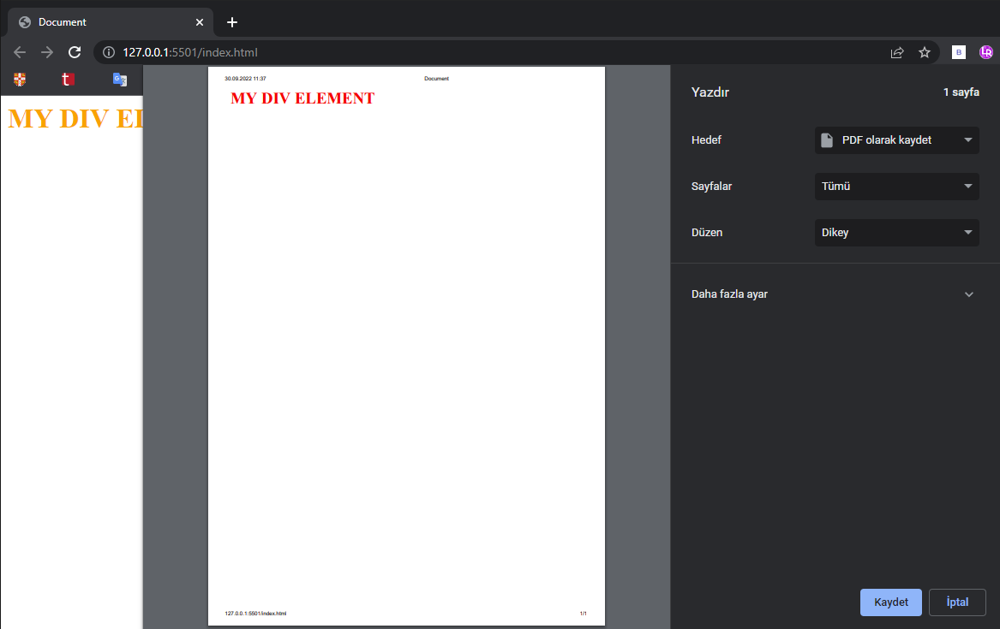

### **Media Queries**

```html
<!DOCTYPE html>
<html lang="en">
<head>
    <meta charset="UTF-8">
    <meta http-equiv="X-UA-Compatible" content="IE=edge">
    <meta name="viewport" content="width=device-width, initial-scale=1.0">
    <title>Document</title>
    <style>
        .div{
            font-size: 200%;
            color: orange;
            font-weight: bold;
        }

        @media print{
            .div{
                color: red;
            }
        } 
    </style>
</head>
<body>
    <div class="div">MY DIV ELEMENT</div>
</body>
</html>
```



---

```css
/* bilgisayar, tablet ve telefon ekranları */
@media screen{
          
 } 
```

```css
/* ekran okuma modu (engelliler için) */
@media speech{
          
 } 
```

```css
/* bütün durumlar */
@media all { 
            
}
```

---

```css
/*ekran width 'i ekran height 'ından büyük olduğunda devreye girer*/
 @media (orientation: landscape){

 }
```